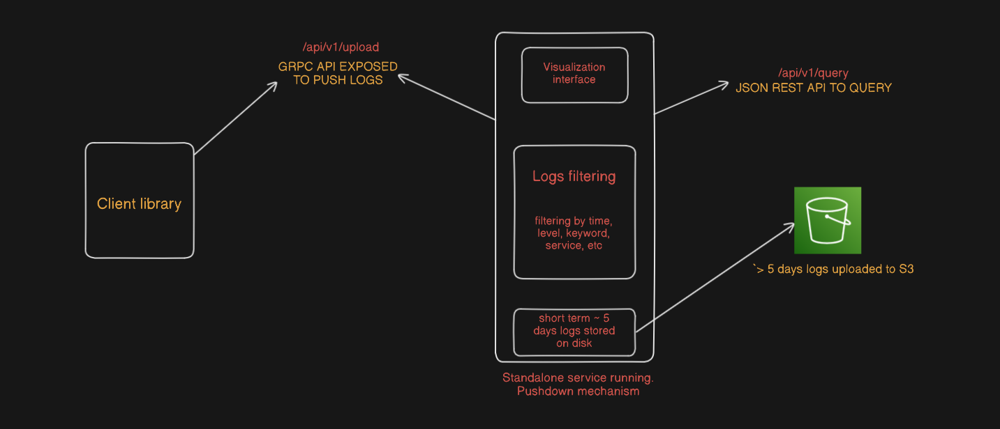
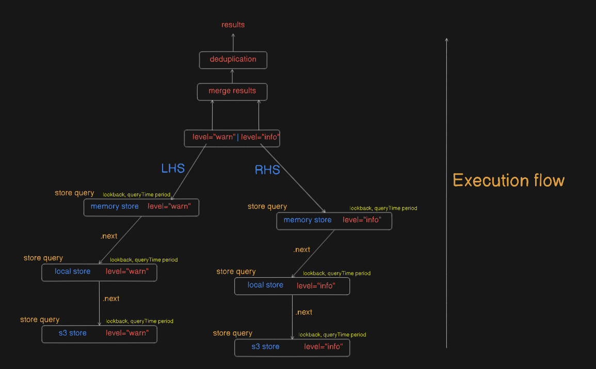

# LogsGo
<p align="center">
  
</p>

**LogsGo** is a standalone, scalable log ingestion and querying service designed for maximum log retention. It features a multi-tiered store architecture, pluggable backends, and a web-based dashboard. Logs are ingested via gRPC and flushed across configured stores based on a customizable time interval.

---

> Checkout [/docs](https://github.com/Saumya40-codes/LogsGO/tree/main/docs) to see the arch design, auth flows and several other brainstorming made for this project :)

## Features

-  **Push-based log ingestion** using a lightweight gRPC client.
-  **Multi-tiered store architecture**:
    - **In-memory store** → for fast ingestion and short-term access.
    - **Local store** → persistent storage by [BadgerDB](https://github.com/dgraph-io/badger).
    - **Cloud store** → support for S3-compatible services like AWS S3 or MinIO.
-  **Chained store design**: Each store passes query and flush operations to its `.next` store for transparent fallbacks and deep queries.
-  **Custom query language**: Enables querying logs with `AND`/`OR` operators. Example:
  
    ```
    service=ap-south-1&level=warn
    ```
    ```
    service=ap-south-1|service="us-west-1"
    ```
    
- **Web dashboard**: Simple UI to query and visualize logs.
- **Client library**: Embed the LogsGo client into your service and send logs using `UploadLogs()` over gRPC. Example:
  ```
    import "github.com/Saumya40-codes/LogsGO/client/go/logclient"
    
    c := logclient.NewLogClient(ctx, my_logsGo_endpoint_url)
    c.UploadLog(&logclient.Opts{
        {
            Service: "apsouth-1",
            Level: "warn",
            Message: "Disk usage high",
            Timestamp: time.Now(),
        },
    })
  ```

       
- **Configurable flush intervals** for controlling when logs are forwarded from one store to the next.

---

## Architecture Overview



1. Logs are received via the gRPC client.
2. They are stored first in an in-memory buffer.
3. At regular intervals, logs are flushed to:
 - Local store (BadgerDB)
 - Then to S3-compatible object store (e.g., AWS S3, MinIO)
4. Queries traverse through each store using a `.next` store in chain until results are found.

---
## DataModel Overview


---
## Query Execution Overview



## Current State


The output you see is an instant query, many of the logs you see were first uploaded to s3 and local storage, the count you see is an aggregation and timestamp is the time at which this was found in latest


This starts from start timestamp and moves by 'resolution' amount till end timestamp, the count is the number of logs found in that range, currently if no logs are found in that range, the value at that timestamp isn't shown.


## Running interactive example

You can run an interactive examples from /examples folder, just navigate there and run
```
docker compose up
```
